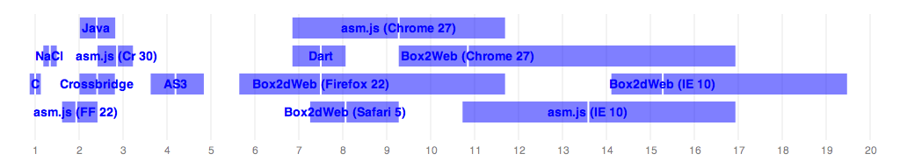

### Old results (5 July 2013):

|                           | ms/frame | 5th %ile | 95th %ile | Ratio to C |
|---------------------------|----------|----------|-----------|------------|
|C (gcc 4.8)                | 2.48     | 2.17     | 2.80      | 1.00       |
|NaCl (x86-32)              | 3.31     | 2.94     | 3.70      | 1.34       |
|asm.js (Firefox 22)        | 4.80     | 4.0      | 6.0       | 1.94       |
|Java (1.8)                 | 5.95     | 5.00     | 7.00      | 2.40       |
|Flash/Crossbridge (\*)     | 5.98     | 4.98     | 6.98      | 2.41       |
|asm.js (Chrome 30)         | 7.10     | 6.0      | 8.0       | 2.86       |
|AS3                        | 10.4     | 9.00     | 12.0      | 4.19       |
|Box2dWeb (Firefox 22)      | 16.1     | 13.0     | 23.0      | 6.50       |
|Dart                       | 18.6     | 17.0     | 20.0      | 7.50       |
|Box2dWeb (Safari 6)        | 20.0     | 18.0     | 23.0      | 8.07       |
|asm.js (Chrome 27)         | 23.0     | 17.0     | 29.0      | 9.27       |
|Box2dWeb (Chrome 27)       | 26.9     | 23.0     | 42.0      | 10.9       |
|asm.js (IE10) (\*\*)       | 33.7     | 26.6     | 42.0      | 13.6       |
|Box2dWeb (IE10) (\*\*)     | 37.9     | 35.0     | 48.3      | 15.3       |
|asm.js (Safari) (\*\*\*)   | -        | -        | -         | -          |

[Test platform: MacBook Pro, 2.5 GHz i7, 16G memory, Mac OS X 10.8.4.
 All platform and compiler versions are latest unless otherwise specified.]

(*) Crossbridge has awful clock() resolution, so I just assumed +/- 1ms
percentiles.

(**) I don't have any easy way to run Windows natively on my Mac (I'm not
going to setup dual boot partitions just for this benchmark), so I had to try
and back out IE10 numbers using VirtualBox. I calculated a performance penalty
ratio by running the Javascript benchmarks on Chrome/Mac and Chrome/Win (VM)
(`38.5ms / 26.9ms = 1.43x`), then used that to adjust the IE10 numbers. There
are all sorts of things that could be wrong with this, but I expect it at
least gives us a rough idea.

(***) asm.js unfortunately hung on Safari and never recovered. Hopefully
this will be sorted out at some point.

  

  Scaled to multiples of native performance. The white line denotes the mean,
  and the edges of   the box denote the 5th and 95th %iles.

