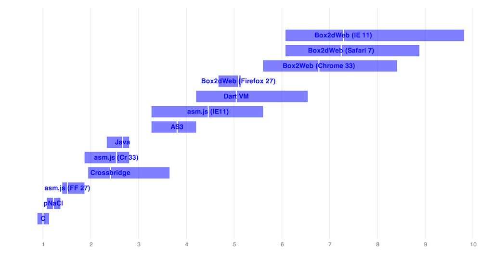

### Old results (15 March 2014):

|                           | ms/frame | 5th %ile | 95th %ile | Ratio to C |
|---------------------------|----------|----------|-----------|------------|
|C (clang-500.2.79)         | 2.14     | 1.89     | 2.41      | 1.00       |
|pNaCl                      | 2.61     | 2.31     | 2.92      | 1.22       |
|asm.js (Firefox 27)        | 3.24     | 3.00     | 4.00      | 1.51       |
|Flash/Crossbridge (\*)     | 5.16     | 4.16     | 7.81      | 2.41       |
|asm.js (Chrome 33)         | 5.43     | 4.00     | 6.00      | 2.54       |
|Java (1.8)                 | 5.71     | 5.00     | 6.00      | 2.67       |
|AS3                        | 8.15     | 7.00     | 9.00      | 3.81       |
|asm.js (IE11)              | 9.54     | 7.00     | 12.0      | 4.46       |
|Dart (Dartium)             | 10.8     | 9.00     | 14.0      | 5.05       |
|Box2dWeb (Firefox 27)      | 10.9     | 10.0     | 11.0      | 5.10       |
|Box2dWeb (Chrome 33)       | 14.5     | 12.0     | 18.0      | 6.78       |
|Box2dWeb (Safari 7)        | 15.5     | 13.0     | 19.0      | 7.24       |
|Box2dWeb (IE11)            | 15.6     | 13.0     | 21.0      | 7.29       |
|Dart2js (Chrome 33)        | 30.6     | 26.0     | 35.0      | 14.3       |
|asm.js (Safari 7) (\*\*)   | 272.     | 240.     | 309.      | 127.       |

[Test platform: MacBook Pro, 2.3 GHz i7, 16G memory, Mac OS X 10.9.2, Windows 7.
 All platform and compiler versions are latest unless otherwise specified.]

(*) Crossbridge is exhibiting some kind of problem calculating 5th %ile, so I
just set it to the mean - 1.

(**) asm.js performs so badly on Safari 7 that I left it off the graph to
avoid making it impossible to read.

  

  Scaled to multiples of native performance. The white line denotes the mean,
  and the edges of   the box denote the 5th and 95th %iles.

