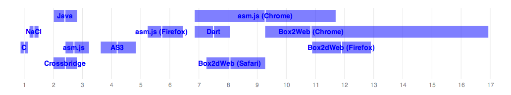

## What is this?

A simple VM performance benchmark suite that attempts to guage the performance of various VMs on a real-world
workload using the Box2D (http://box2d.org/) physics library. This library is particularly suited to benchmarking
VM performance because it's compute-intensive, often a real-world performance bottleneck in games, and has been
ported to many languages. You can find more background [here](http://j15r.com/blog/2011/12/15/Box2D_as_a_Measure_of_Runtime_Performance),
[here](http://j15r.com/blog/2013/04/25/Box2d_Revisited), and [here](http://j15r.com/blog/2013/04/25/Box2d_Addendum).

### Current results (as of 5 July 2013):

  <table>
    <tr><th></th>                         <th>ms/frame</th><th>5th %ile</th><th>95th %ile</th><th>Ratio to C</th></tr>
    <tr><td>C (gcc 4.8)</td>              <td>2.48</td><td>2.17</td><td>2.80</td><td>1.00</td></tr>
    <tr><td>NaCl (x86-32)</td>            <td>3.31</td><td>2.94</td><td>3.70</td><td>1.34</td></tr>
    <tr><td>Java (1.8)</td>               <td>5.95</td><td>5.00</td><td>7.00</td><td>2.40</td></tr>
    <tr><td>Flash/Crossbridge (*)</td>    <td>5.98</td><td>4.98</td><td>6.98</td><td>2.41</td></tr>
    <tr><td>asm.js (**)</td>              <td>6.72</td><td>6.00</td><td>8.00</td><td>2.71</td></tr>
    <tr><td>AS3</td>                      <td>10.4</td><td>9.00</td><td>12.0</td><td>4.19</td></tr>
    <tr><td>asm.js (Firefox)</td>         <td>14.2</td><td>13.0</td><td>16.0</td><td>5.73</td></tr>
    <tr><td>Dart</td>                     <td>18.6</td><td>17.0</td><td>20.0</td><td>7.50</td></tr>
    <tr><td>Box2dWeb (Safari)</td>        <td>20.0</td><td>18.0</td><td>23.0</td><td>8.07</td></tr>
    <tr><td>asm.js (Chrome)</td>          <td>23.0</td><td>17.0</td><td>29.0</td><td>9.27</td></tr>
    <tr><td>Box2dWeb (Chrome)</td>        <td>26.9</td><td>23.0</td><td>42.0</td><td>10.9</td></tr>
    <tr><td>Box2dWeb (Firefox)</td>       <td>29.5</td><td>27.0</td><td>32.0</td><td>12.0</td></tr>
    <tr><td>asm.js (IE10) (***)</td>      <td>33.7</td><td>26.6</td><td>42.0</td><td>13.6</td></tr>
    <tr><td>Box2dWeb (IE10) (***)</td>    <td>37.9</td><td>35.0</td><td>48.3</td><td>15.3</td></tr>
    <tr><td>asm.js (Safari) (****)</td>   <td>-</td><td>-</td><td>-</td><td>-</td></tr>
  </table>

  (*) Crossbridge has awful clock() resolution, so I just assumed +/- 1ms
  percentiles.

  (**) Here, 'asm.js' refers to the asm.js output running in Firefox Nightly,
  with full optimizations.

  (***) I don't have any easy way to run Windows natively on my Mac (I'm not
  going to setup dual boot partitions just for this benchmark), so I had to try
  and back out IE10 numbers using VirtualBox. I calculated a performance penalty
  ratio by running the Javascript benchmarks on Chrome/Mac and Chrome/Win (VM)
  (`38.5ms / 26.9ms = 1.43x`), then used that to adjust the IE10 numbers. There
  are all sorts of things that could be wrong with this, but I expect it at
  least gives us a rough idea.

  (****) asm.js unfortunately hung on Safari and never recovered. Hopefully
  this will be sorted out at some point.

  [Test platform: MacBook Pro, 2.5 GHz i7, 16G memory, Mac OS X 10.8.4.
   All platform and compiler versions are latest unless otherwise specified.]

  

  Scaled to multiples of native performance. The white line denotes the mean,
  and the edges of   the box denote the 5th and 95th %iles.

### Mini FAQ:

- But physics library (X) outperforms Box2D on platform (Y)!
  - That's not the point. The point is to test *VM* performance by using a similar code base on different platforms.
- But Box2dweb is a crappy port of Flash code!
  - Feel free to improve it, or hand-port your own. I'll happily accept the patch.
    That said, the code's fairly straightforward, and I'd be surprised if manual tweaking of it made much of a difference.

## Test platforms:

- Mac OS X: I'm using this. It works well.
- Linux: Others use this. It seems to work, but I don't personally test it.
- Windows: Can probably be cajoled into working, but will likely take a lot of manual labor.

## Required tools:

- GCC: If you're running these benchmarks, you should know how to get this.
- JDK: I believe any JDK after 1.5 will work; I'm using 1.7.
- NaCl SDK: https://developers.google.com/native-client/sdk/download
- LLVM: http://llvm.org/ (I installed it with homebrew)
- Emscripten: https://github.com/kripken/emscripten/wiki (you have to build it, but there's a quick tutorial)
- Flex SDK: http://www.adobe.com/devnet/flex/flex-sdk-download.html
- Adobe Crossbridge: http://adobe-flash.github.io/crossbridge/
- Dart SDK: http://www.dartlang.org/tools/sdk/

## Environment variables (largely to locate the above tools):

- `$FLEX_SDK`: Flex SDK directory (e.g., `/opt/flex_sdk_4.6`)
- `$EMSCRIPTEN`: Directory containing the built emscripten compiler (e.g., `~/src/emcscripten`)
- `$LLVM`: Directory containing the `llvm` binaries (e.g., `/usr/local/bin`)
- `$NACL_SDK`: Directory containing the NaCl SDK version you want to use (e.g., `/opt/nacl_sdk/pepper_26`)
- `$CROSSBRIDGE`: (e.g., `/opt/crossbridge/sdk`)

## Targets:

- /c:
  - c: `make -f bench2d.mk; bench2d`
  - asm.js: `make -f bench2d.asmjs.mk` (open bench2d_asm.js.html -- in Firefox nightly to see asm.js optimizations)
  - nacl: `make -f bench2d.nacl.mk; python httpd.py` (open http://localhost:5103/bench2d_nacl.html in Chrome -- it won't work from a file:// url)
  - crossbridge: `./make-crossbridge; crossbridge_build/bench2d_crossbridge` (or open crossbridge_build/bench2d_crossbridge.swf in the standalone Flash Player)
- /java:
  - `ant run`
- /js:
  - `run-d8` (if you have V8's standalone shell, or open bench2d_run.html in your favorite browser)
- /as3: 
  - `./build` (open Bench2d.html in your favorite browser, or Bench2d.swf in the standalone Flash Player)
  - (There's also a version that uses the "Nape" physics library, but this is not relevent to VM benchmarking)
- /dart:
  - `pub update; dart bench2d.dart`

## Future work

- Make the timer resolution less bad.
- Find a way to automate the benchmarks.
- Benchmark IE9+.
- Benchmark .NET
